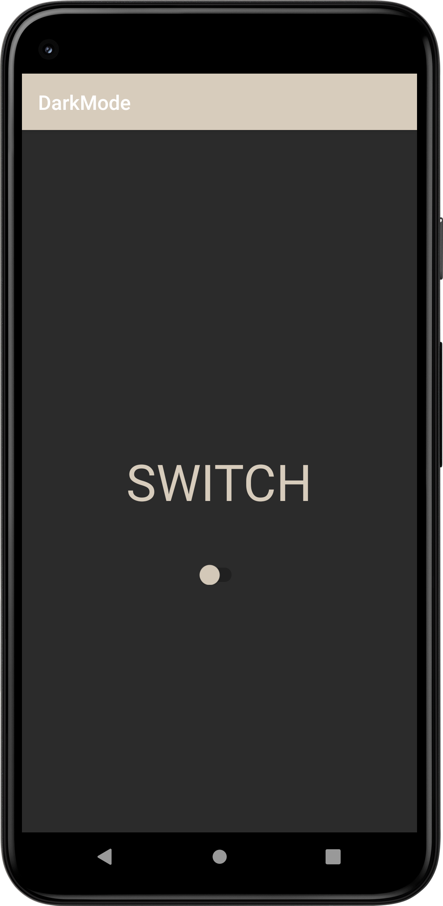
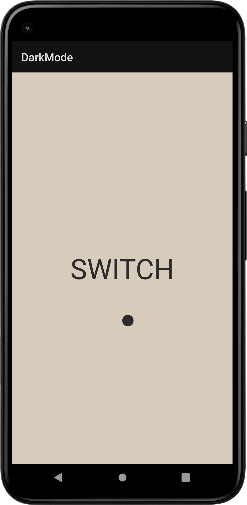

# AndroidDarkMode
> <b>Author: Nicola De Nicolais</b>

## Screen preview
<p float="left">


</p>

## 📍 Description
This app provides an easy way to switch between light and dark theme in your app.<br>
The dark mode can bring to people to reduce power usage by a significant amount, to improve visibility for users with low vision and those who are sensitive to bright light and also to make the use of smartphone easier for everyone to use a device in a low-light environment.

## 💎 Features
Each time we click the switch the chosen theme will be based on the colors set in the file . xml

To select dark theme
```
AppCompatDelegate.setDefaultNightMode(AppCompatDelegate.MODE_NIGHT_YES)
```
It means night mode is active and we’re using dark theme

To return to light theme
```
AppCompatDelegate.setDefaultNightMode(AppCompatDelegate.MODE_NIGHT_NO)
```
It means night mode is not active, we’re using the light theme

## 🔧 Customize
To customize the light theme change the colors in the .xml file in this path:
```\darkmode\app\src\main\res\values\themes.xml ```

To customize the dark theme change the colors in the .xml file in this path:
```\darkmode\app\src\main\res\values-night\themes.xml ```
